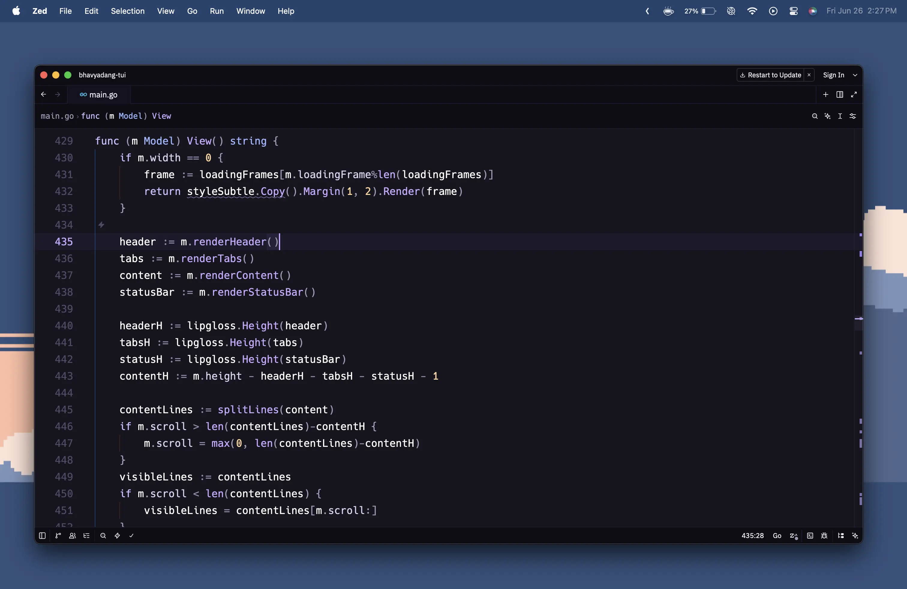
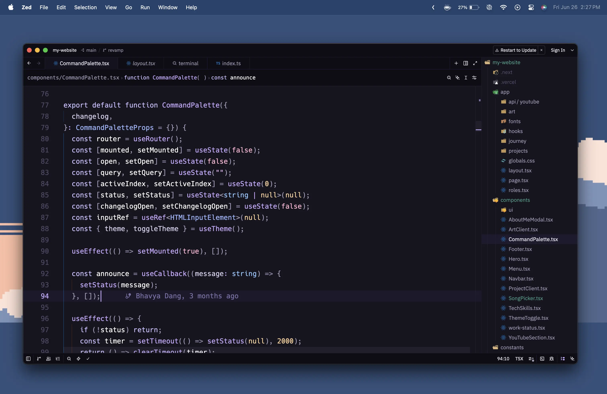
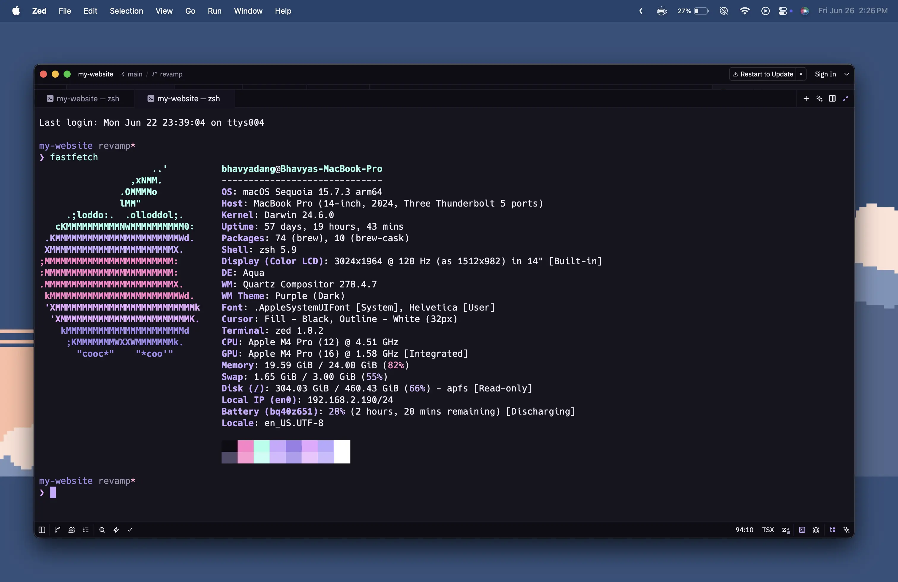
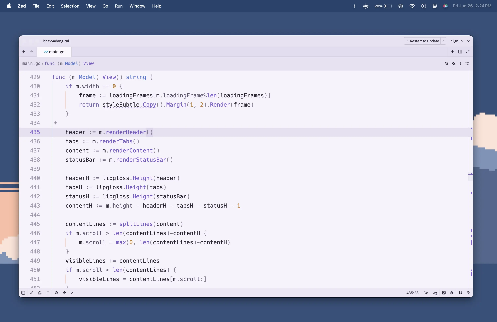
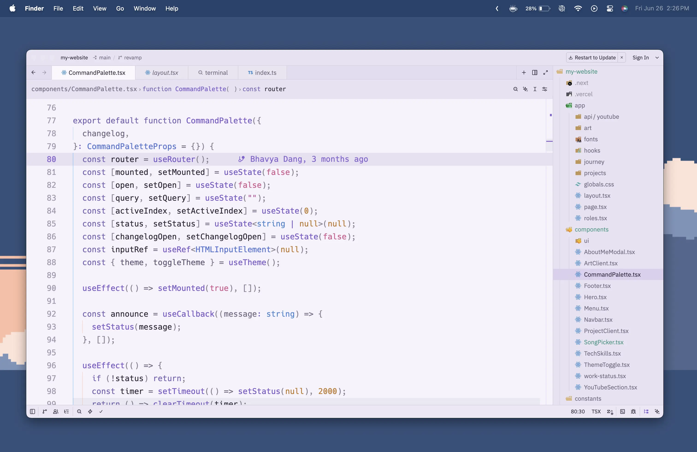
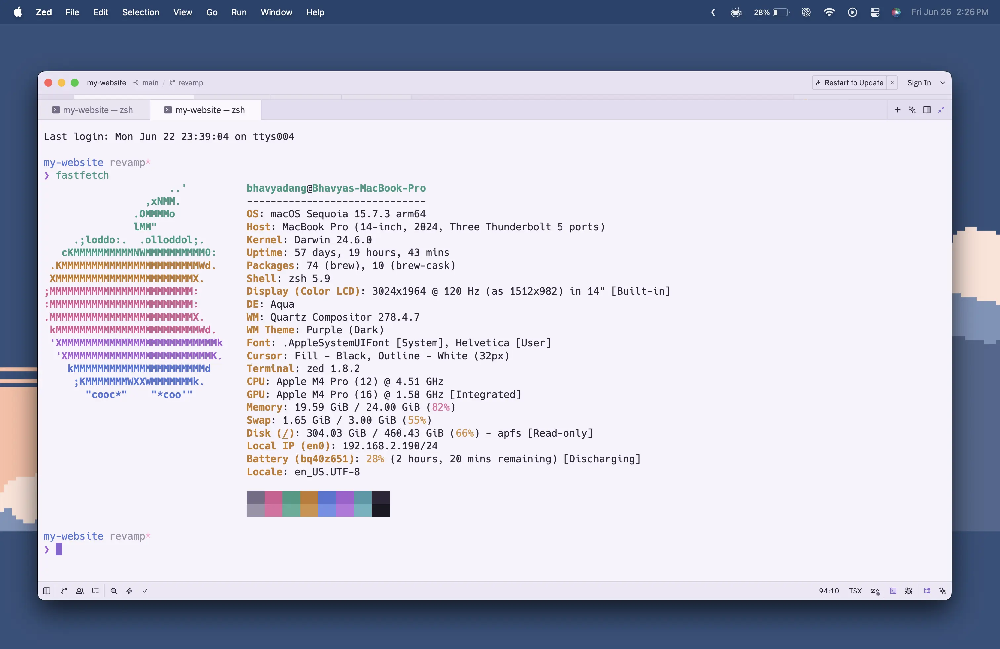

# Solace

A minimal Zed theme with violet undertones and pastel syntax.

Solace pairs deep violet backgrounds with soft lavender accents and muted pastel syntax colors for a calm, focused work experience. Available in **Dark** and **Light** variants.

## Installation

### Option A — Install script (recommended)

```sh
curl -fsSL https://raw.githubusercontent.com/bhavya-dang/Solace/master/scripts/install.sh | sh
```

### Option B — Clone the repo

```sh
git clone https://github.com/bhavya-dang/Solace
cd Solace
cp themes/solace.json ~/.config/zed/themes/
```

Restart Zed or reload the theme selector (Cmd+Shift+P → "theme selector: toggle").

## Screenshots

### Solace





### Solace Light





## Contributing

Any kind of feedback is welcome.
Feel free to open an issue or raise a PR for contributions.
