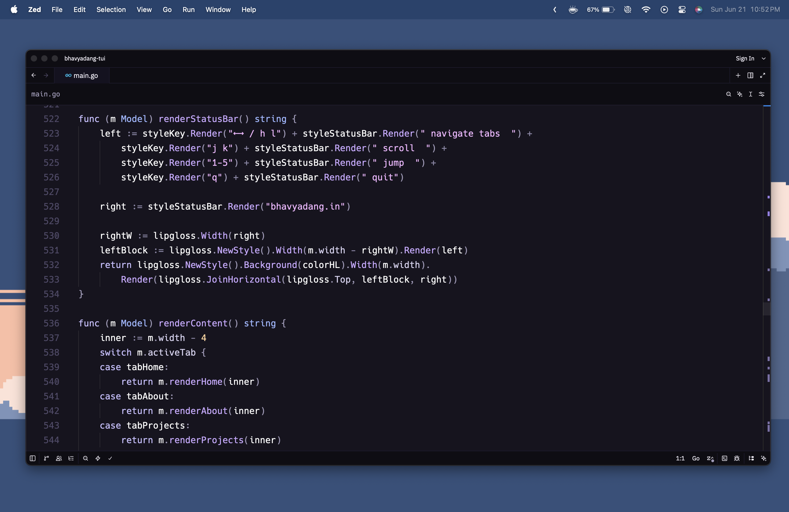
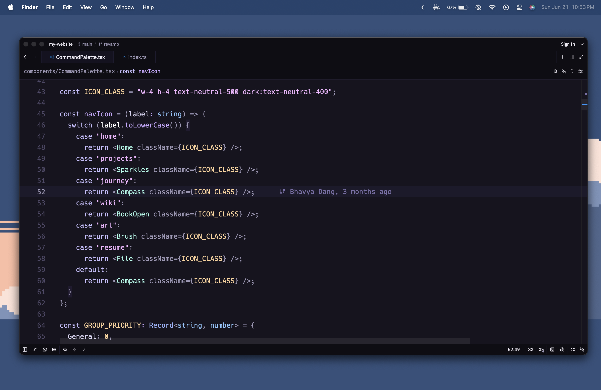
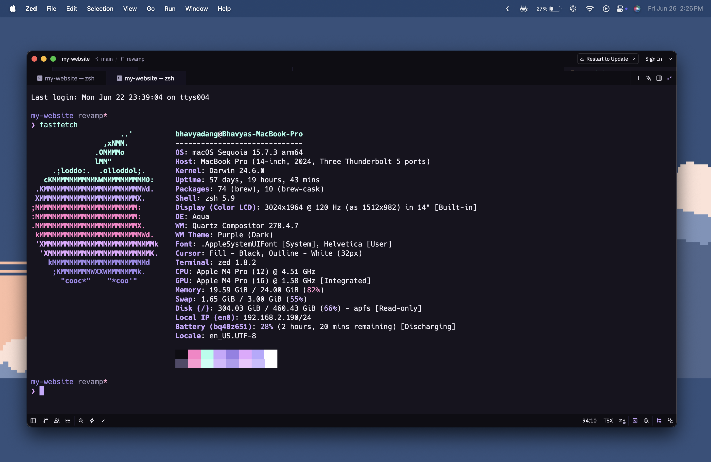
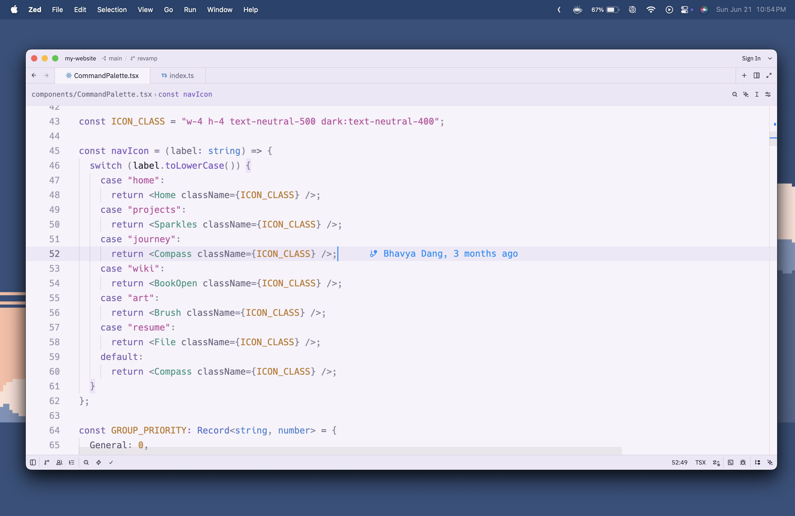
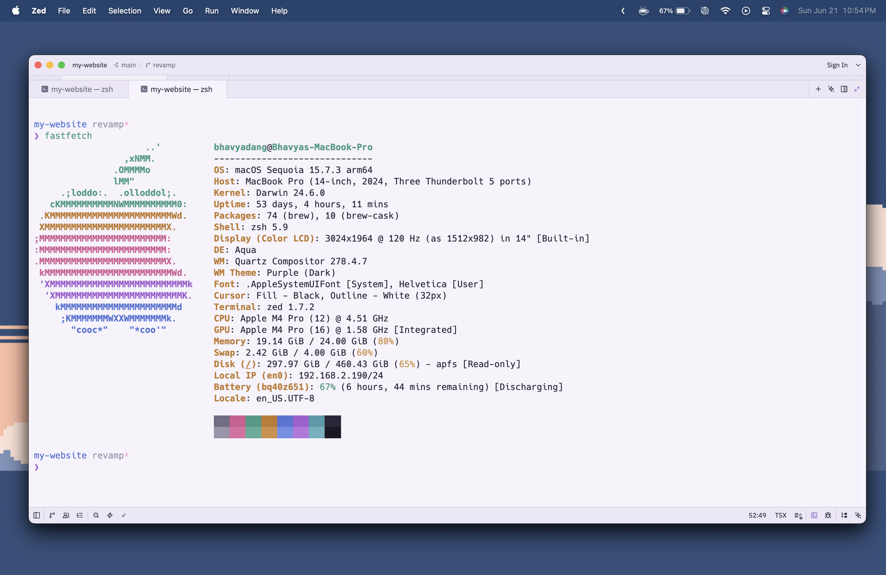

# Solace

A minimalistic theme with violet accents and pastel syntax.

Solace is a carefully balanced theme for Zed that combines deep violet backgrounds, soft lavender accents, and pastel syntax colors.


## Installation

Open Zed and install **Solace** from the extensions marketplace.

You can also install it manually:

```sh
git clone https://github.com/bhavya-dang/Solace \
  ~/.config/zed/extensions/solace
```

Restart Zed or reload extensions.

## Screenshots

### Solace





### Solace Light






## Contributing

Any kind of feedback is welcome.
Feel free to open an issue or raise a PR for contributions.
